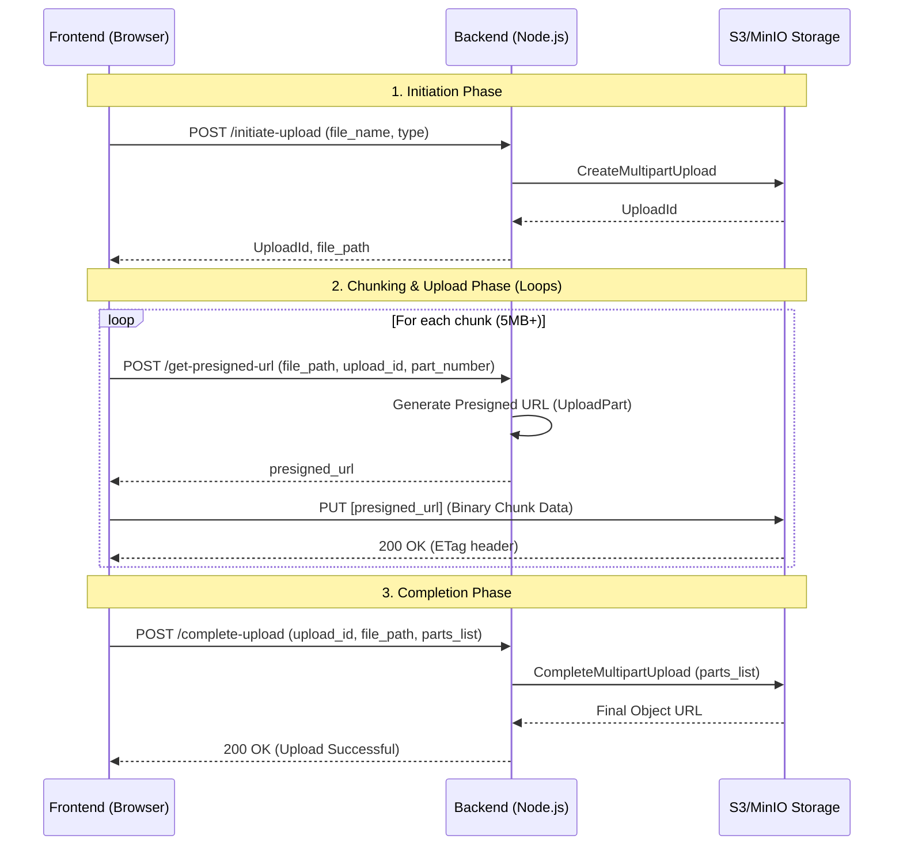

# Multipart File Upload Flow Documentation

This document outlines the complete flow for uploading large files to S3/MinIO using multipart uploads. This approach allows for parallel chunk uploads, resilience to network interruptions, and support for very large files.

## High-Level Architecture

The process involves coordination between the **Frontend (Vue.js)**, the **Backend (Node.js)**, and the **Object Storage (S3/MinIO)**.



---

## API Endpoints

### 1. Initiate Upload
**Endpoint:** `POST /api/v1/s3/initiate-upload`

Starts the multipart upload process on S3 and returns a unique `upload_id`.

- **Request Body:**
  ```json
  {
    "file_name": "example.mp4",
    "file_type": "video/mp4",
    "entity": "user_upload",
    "entity_id": "123",
    "collection_name": "media"
  }
  ```
- **Success Response:**
  ```json
  {
    "upload_id": "XYX...123",
    "file_path": "media/user_upload/123/1713.../example.mp4",
    "media_id": 1713...
  }
  ```

### 2. Get Presigned URL
**Endpoint:** `POST /api/v1/s3/get-presigned-url`

Generates a temporary URL that allows the browser to upload a specific part directly to S3.

- **Request Body:**
  ```json
  {
    "file_path": "media/user_upload/123/...",
    "upload_id": "XYX...123",
    "part_number": 1,
    "file_type": "video/mp4"
  }
  ```
- **Success Response:**
  ```json
  {
    "presigned_url": "http://minio:9000/bucket/path?X-Amz-Signature=..."
  }
  ```

### 3. Complete Upload
**Endpoint:** `POST /api/v1/s3/complete-upload`

Finishes the upload by joining all uploaded parts into a single object.

- **Request Body:**
  ```json
  {
    "upload_id": "XYX...123",
    "file_path": "media/user_upload/123/...",
    "part_numbers": [
      { "PartNumber": 1, "ETag": "etag-1" },
      { "PartNumber": 2, "ETag": "etag-2" }
    ]
  }
  ```
- **Success Response:**
  ```json
  {
    "message": "Upload completed successfully!",
    "url": "http://localhost:9000/test-bucket/..."
  }
  ```

### 4. Abort Upload
**Endpoint:** `POST /api/v1/s3/abort-upload`

Cancels the upload and cleans up any partially uploaded parts from S3.

- **Request Body:**
  ```json
  {
    "upload_id": "XYX...123",
    "file_path": "media/user_upload/123/..."
  }
  ```

---

## Implementation Details

### Chunk Management
- **Minimum Chunk Size:** 5 MB (S3 requirement).
- **Concurrency:** The frontend uses a worker pool (default 3) to upload multiple chunks in parallel.
- **ETag Recording:** The browser must capture the `ETag` header from the S3 response after every chunk upload. These tags are required for the "Complete" step.

### Error Handling & Retries
- Each chunk upload includes retry logic (default 3 attempts) with exponential backoff.
- If the overall process fails or is canceled by the user, the `abort-upload` endpoint should be called to avoid storage leaks.

### Security
- The browser never receives S3 credentials. It only uses short-lived **Presigned URLs** for the actual data transfer.
- The backend validates the request before generating these URLs.
