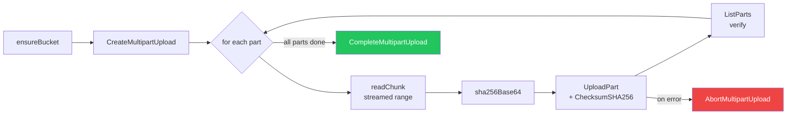

<div align="center">

# 🚀 Multipart Upload to MinIO

### A Node.js Proof‑of‑Concept for S3‑Compatible Chunked Uploads with SHA‑256 Integrity

<br>


<br>

**Stream a 5 GB ISO to object storage, one 100 MiB chunk at a time — checksummed, resumable, and abort‑safe.**

[Overview](#-overview) •
[Quick Start](#-quick-start) •
[How It Works](#-how-it-works) •
[API Reference](#-api-reference) •
[Caveats](#-design-notes--caveats)

</div>

---

## 📖 Overview

A compact, dependency‑light Node.js script that demonstrates **S3‑compatible multipart upload** against a local MinIO server using the AWS SDK for JavaScript v3. It splits a large file into **100 MiB parts**, uploads each with its own **SHA‑256 checksum**, and either **completes** or **aborts** the upload atomically. A companion helper lists in‑flight multipart uploads so you can detect orphans and debug failed transfers.

> **Entry point:** [s3.js](s3.js)

### ✨ Highlights

| | Feature | What you get |
|---|---|---|
| 🧩 | **Multipart chunking** | 100 MiB parts, well above S3's 5 MiB minimum |
| 🔐 | **Per‑part checksums** | SHA‑256 (Base64) verified by MinIO on upload |
| 🧠 | **Low memory footprint** | One part buffered in RAM at a time — streamed off disk |
| ⚛ | **Atomic finalize** | The object only materializes on `CompleteMultipartUpload` |
| 🧹 | **Auto‑cleanup on error** | `AbortMultipartUpload` runs if anything throws |
| 🔍 | **Orphan detection** | `ListMultipartUploads` + `ListParts` helper utility |

---

## 📦 Prerequisites

<table>
<tr><th>Requirement</th><th>Details</th></tr>
<tr>
  <td>🟢 <b>Node.js</b></td>
  <td>v18+ (project uses native ESM — <code>"type": "module"</code>)</td>
</tr>
<tr>
  <td>🗄️ <b>MinIO server</b></td>
  <td>Running at <code>http://localhost:9000</code></td>
</tr>
<tr>
  <td>🔑 <b>Credentials</b></td>
  <td>Default dev creds: <code>minioadmin</code> / <code>minioadmin</code></td>
</tr>
<tr>
  <td>📀 <b>Test file</b></td>
  <td><code>./manjaro.iso</code> (~5.4 GB in this POC) at project root</td>
</tr>
</table>

---

## ⚡ Quick Start

### 1️⃣ Install

```bash
npm install
```

The only runtime dependency is [@aws-sdk/client-s3](package.json#L4).

### 2️⃣ Spin up MinIO

```bash
docker run -p 9000:9000 -p 9001:9001 \
  -e MINIO_ROOT_USER=minioadmin \
  -e MINIO_ROOT_PASSWORD=minioadmin \
  minio/minio server /data --console-address ":9001"
```

> 💡 The MinIO console is at **http://localhost:9001** — handy for visually confirming the upload.

### 3️⃣ Run

```bash
node s3.js
```

By default the script **lists incomplete uploads**. To perform an actual upload, flip the tail of [s3.js:176-177](s3.js#L176-L177):

```diff
- listIncompleteUploads("demo").catch(console.error);
- // multipartUpload().catch(console.error);
+ // listIncompleteUploads("demo").catch(console.error);
+ multipartUpload().catch(console.error);
```

---

## 🛠 Configuration

All knobs are inline in [s3.js](s3.js):

| 📍 Location | ⚙️ Setting | 🔧 Value |
|---|---|---|
| [s3.js:23-31](s3.js#L23-L31) | `S3Client` | `region: us-east-1`, `endpoint: http://localhost:9000`, `forcePathStyle: true` |
| [s3.js:66-68](s3.js#L66-L68) | Bucket / key / source | `demo` / `manjaro.iso` / `./manjaro.iso` |
| [s3.js:72](s3.js#L72) | `PART_SIZE` | `100 * 1024 * 1024` (100 MiB) |
| [s3.js:86](s3.js#L86) | `ChecksumAlgorithm` | `"SHA256"` |

> ⚠️ **`forcePathStyle: true` is mandatory for MinIO** — it uses path‑style addressing (`host/bucket/key`), not AWS's virtual‑host style (`bucket.host/key`).

---

## 🔬 How It Works

### The flow at a glance



### Why multipart?

S3 (and MinIO) **requires** multipart upload for objects > 5 GB, and **recommends** it above ~100 MiB. Each part is:

- 🔒 At least 5 MiB (last part excepted)
- 🔁 Independently retryable — no need to restart the whole transfer
- ✅ Integrity‑checked server‑side via its own checksum

This POC picks a **100 MiB** part size — a reasonable sweet spot between memory use and request count.

---

## 📚 API Reference

<details open>
<summary><b><code>sha256Base64(buffer) → string</code></b> &nbsp;·&nbsp; <a href="s3.js#L37-L39">s3.js:37‑39</a></summary>

Computes SHA‑256 of a `Buffer` and returns it **Base64‑encoded** — the format AWS/MinIO expects for the `ChecksumSHA256` field on `UploadPartCommand`.
</details>

<details open>
<summary><b><code>readChunk(filePath, start, end) → Promise&lt;Buffer&gt;</code></b> &nbsp;·&nbsp; <a href="s3.js#L42-L50">s3.js:42‑50</a></summary>

Reads a byte range `[start, end]` from `filePath` via `fs.createReadStream` and concatenates it into a single `Buffer`. Using a read stream with `start`/`end` avoids loading the whole file into memory — **only one part is ever resident at a time**.
</details>

<details open>
<summary><b><code>ensureBucket(bucket) → Promise&lt;void&gt;</code></b> &nbsp;·&nbsp; <a href="s3.js#L52-L63">s3.js:52‑63</a></summary>

Issues a `HeadBucketCommand`; on 404/NotFound, creates the bucket with `CreateBucketCommand`. All other errors propagate.
</details>

<details open>
<summary><b><code>multipartUpload() → Promise&lt;void&gt;</code></b> &nbsp;·&nbsp; <a href="s3.js#L65-L156">s3.js:65‑156</a></summary>

Orchestrates the full upload lifecycle:

1. **Bucket check** — `ensureBucket(bucket)`
2. **Part planning** — `fs.statSync` → `numParts = ceil(fileSize / PART_SIZE)`
3. **Initiate** — `CreateMultipartUploadCommand` with `ChecksumAlgorithm: "SHA256"` → server returns an `UploadId`
4. **Upload loop** (sequential) — per part:
   - Compute byte range `[start, end]`
   - `readChunk` → `Buffer`
   - `sha256Base64` → checksum
   - `UploadPartCommand` with `PartNumber`, `Body`, `ChecksumSHA256`
   - Collect `{ PartNumber, ETag, ChecksumSHA256 }` into `parts[]`
   - `ListPartsCommand` to confirm server‑side state (diagnostic)
5. **Complete** — `CompleteMultipartUploadCommand` with the assembled `parts[]`
6. **Abort on failure** — any thrown error triggers `AbortMultipartUploadCommand`, then re‑throws
</details>

<details open>
<summary><b><code>listIncompleteUploads(bucket) → Promise&lt;Upload[]&gt;</code></b> &nbsp;·&nbsp; <a href="s3.js#L158-L174">s3.js:158‑174</a></summary>

Lists all in‑progress multipart uploads in `bucket` via `ListMultipartUploadsCommand`. For each upload it also calls `ListPartsCommand` to enumerate already‑uploaded parts, attaches them as `upload.Parts`, logs, and returns the array.

**Use it to:**

- 🐛 Debug a failed upload (see what parts survived)
- 🧟 Detect abandoned uploads still occupying storage
- ♻️ Resume an upload (you already have the `UploadId` and part list)
</details>

---

## 🖥 Sample Output

```text
File size: 5154.0 MiB, parts: 52
Uploading part 1/52 (bytes 0–104857599)…
Parts uploaded so far:   [ { PartNumber: 1, ETag: '"…"', ChecksumSHA256: '…' } ]
S3 confirmed parts:      [ { PartNumber: 1, ETag: '"…"', Size: 104857600, … } ]
Uploading part 2/52 (bytes 104857600–209715199)…
…
✔ Upload completed successfully
```

---

## 🛡 Error Handling & Cleanup

| 🎯 Concern | 🧪 Mechanism |
|---|---|
| **Per‑part integrity** | `ChecksumSHA256` on every `UploadPart`. MinIO rejects the part if the Base64 SHA‑256 doesn't match. |
| **Atomic completion** | The object only becomes visible after `CompleteMultipartUploadCommand`. Until then, parts live under the `UploadId`. |
| **Abort on failure** | `try/catch` in `multipartUpload` triggers `AbortMultipartUploadCommand`, releasing part storage. |
| **Orphan detection** | If the process dies (SIGKILL, crash, network partition) before abort, parts linger. `listIncompleteUploads(bucket)` surfaces them for manual cleanup. |

---

## 🧭 Design Notes & Caveats

> 🔁 **Sequential uploads.** Parts are uploaded one at a time for clarity. Production systems typically upload N parts in parallel (e.g. with `p-limit`) — or use the SDK's high‑level [`@aws-sdk/lib-storage`](https://www.npmjs.com/package/@aws-sdk/lib-storage) `Upload` class, which parallelizes for you.

> 🧠 **Memory footprint.** `readChunk` buffers a full part before upload — peak memory ≈ `PART_SIZE × concurrency` (so ~100 MiB here). A fully streaming body would trim this further.

> ♻️ **No resume logic.** `multipartUpload` always opens a fresh `UploadId`. Resuming would mean reusing an existing `UploadId`, calling `ListParts` to see what's already there, and uploading only the missing ranges.

> 📝 **Redundant `ListParts` in the loop.** [s3.js:125-132](s3.js#L125-L132) calls `ListPartsCommand` after every part — this is diagnostic/illustrative. Remove it in production to halve request count.

> 🔑 **Hard‑coded credentials.** Fine for a local POC; switch to env vars or a credentials provider for anything real.

> 🔢 **Part ordering on complete.** `MultipartUpload.Parts` must be sorted by `PartNumber`. The sequential loop produces sorted order naturally — **parallelism would require an explicit sort before completion**.

---

## 🧰 SDK Commands Used

| 🔧 Command | 📝 Purpose |
|---|---|
| `HeadBucketCommand` | Probe for bucket existence |
| `CreateBucketCommand` | Create missing bucket |
| `CreateMultipartUploadCommand` | Start an upload session → returns `UploadId` |
| `UploadPartCommand` | Upload one numbered part with optional per‑part checksum |
| `ListPartsCommand` | Enumerate uploaded parts for an `UploadId` |
| `CompleteMultipartUploadCommand` | Finalize and assemble the object from parts |
| `AbortMultipartUploadCommand` | Cancel an upload and release part storage |
| `ListMultipartUploadsCommand` | Enumerate all in‑progress uploads in a bucket |

---

<div align="center">

### 🏗 Built with

[](https://www.npmjs.com/package/@aws-sdk/client-s3)
[](https://min.io/)
[](https://nodejs.org/)

<sub>A proof‑of‑concept — not production code. Read it, learn from it, then reach for <a href="https://www.npmjs.com/package/@aws-sdk/lib-storage"><code>@aws-sdk/lib-storage</code></a>.</sub>

</div>
